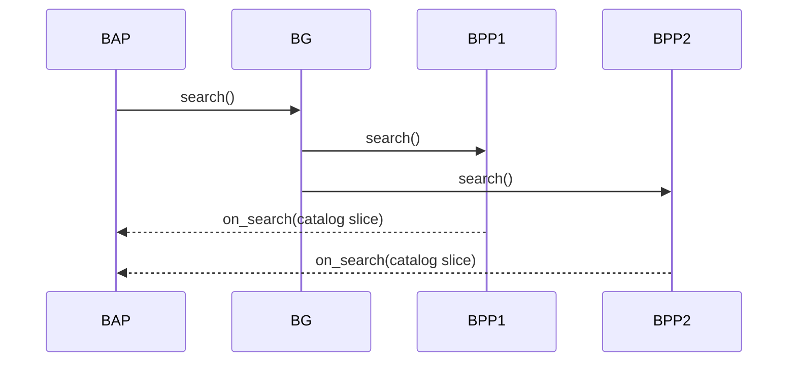
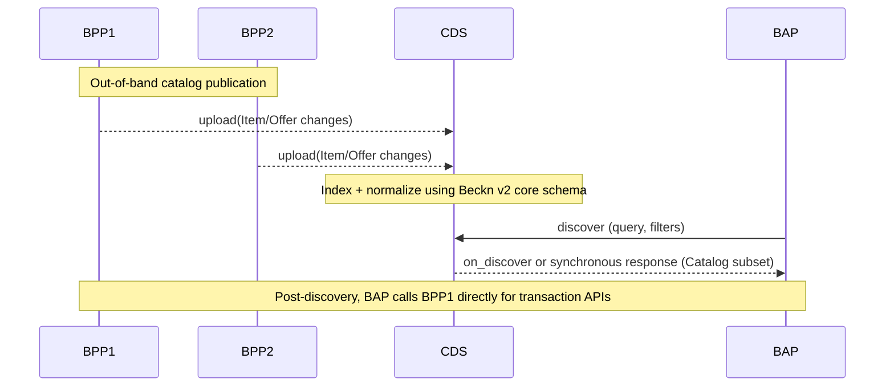

# Beckn Protocol v2.0.0 (Release Candidate)
This repository contains the release candidate of the latest major version release of Beckn Protocol - v2.0.0, defining a JSON-LD and schema.org-aligned core schema, updated APIs, and reference flows for the next generation of Beckn networks. It introduces a catalog-first Catalog Discovery Service (CDS) (replacing the Beckn Gateway for discovery), a DeDi-compliant Network Registry, and a modular “core + schema packs” model to enable strong design-time and run-time composability and global semantic interoperability. 

## 1. High-level goals of v2

Beckn v2 reorganizes the protocol around:
- **Global semantic interoperability** via JSON-LD and deep alignment with schema.org and other globally interoperable linked data schemas.
- Design-time composability: modular core + pluggable domain-specific “schema”.
- **Run-time composability**: independent but interoperable actors (BAP, BPP, CDS, Registry, Agents) that can be recombined without changing the core.
- **Registry and discovery modernization**:
	- BG → CDS: Beckn Gateway is replaced by a Catalog Discovery Service (CDS).
	- Legacy Registry → DeDi-compliant Registry: Network Registry becomes compliant with the Decentralized Directory (DeDi) protocol.  

## 2. Schema changes: from v1.x to v2

### 2.1 From OpenAPI/JSON Schema to JSON-LD + schema.org

#### v1.x
- API and data models primarily expressed as OpenAPI 3.x with embedded JSON Schema.  
- Domain semantics encoded as ad-hoc JSON fields inside the Beckn message envelope.
- Limited machine-readable linkage to global vocabularies.

#### v2.0.0
- All core entities are JSON-LD graphs with:
- @context – Beckn core context + domain contexts.
- @type – Beckn and/or schema.org types (e.g. beckn:Order, schema:Order).
- Fields are explicitly mapped to schema.org wherever possible, with beckn: used for protocol-specific semantics.
- APIs are defined against these JSON-LD entities, not bespoke JSON blobs.

#### Benefits
- Global semantic interoperability:
	- External ecosystems can consume Beckn data as generic JSON-LD / schema.org without custom adapters.
- Forward compatibility:
  - New properties can be added in domain contexts without breaking core parsing.
- Shared tooling:
  - Off-the-shelf semantic tools (RDF libraries, graph DBs, JSON-LD validators) become usable directly.

### 2.2 Core vs Domain-specific Attributes (Schema)

#### v1.x
- Many domain fields placed directly in order, item, or network-specific extensions.
- Adding new sectors often required patching the core schema or adding new domain-specific APIs.

#### v2.0.0
- Core schema: small, stable set of types:
	- Catalog, Item, Offer, Order, OrderItem, Payment, Fulfillment, Invoice, Provider, Buyer, Location, etc.
- Composable Attributes:
	- Each core entity has one or more ...Attributes fields typed as Attributes (JSON-LD containers).
	- Domain / rail-specific models are delivered as composed domain-specific, self describing schema with their own @context and @type definitions.
- Protocol evolution:
  - New industries → new schema, not changes to core.
  - Network policies decide which schema are allowed/required.

#### Design-time composability
- Core entities act as slots into which arbitrary domain vocabularies can be plugged.
- Multiple schema can co-exist for the same entity (e.g. “mobility + carbon accounting” for an Item).
- Networks can:
	- Mandate a minimal schema set for interoperability.
	- Allow additional schema for richer bilateral integrations.

#### Run-time composability
- BAPs, and BPPs, Beckn ONIX, and CDS can inspect @context/@type at run-time to decide which schema they understand.
- Unknown schema can be safely ignored or passed through, keeping backward compatibility.

## 3. API & flow changes

### 3.1 Discovery: BG multicast → CDS push-based discovery

#### v1.x: BG-mediated multicast catalog pull
In v1.x networks, Beckn Gateway (BG) primarily:
- Accepted search from BAPs
- Performed multicast fan-out to all (or policy-filtered) BPPs.
- Direct on_search callback responses back to BAPs.  

The catalog itself was either embedded in responses or pulled by BG/BAP as needed, but the access point for discovery was BG.

#### Workflow (OLD)

### v2.0.0: CDS-centric, asynchronous catalog push
In v2, BG is replaced by a more comprehensive actor: the **Catalog Discovery Service (CDS)**.

#### Key differences:
- Discovery is no longer BG multicast “pull” of catalogs.
- Each BPP asynchronously pushes catalog updates to CDS (publish/notify model).
- BAPs query CDS for discovery; CDS resolves, aggregates, and returns results.
- BAPs reach BPPs directly only when initiating a post-discovery, transaction flow (/select, /init, etc.).

#### Workflow (NEW)

#### Implications
- BG → CDS:
  - BG’s role is expanded into CDS, a catalog-first discovery service with:
  - Rich indexing over standardized Catalog / Item / Offer graphs.
- Network-configurable policies for ranking, filtering, and personalization.
- Decoupled discovery and transaction:
	- Catalog dissemination happens continuously, independent of any specific BAP request.
	- Discovery becomes a read-optimized lookup over the CDS index, not a real-time multicast workflow.

#### Benefits of composability & interoperability
- Discovery strategies (ranking, personalization, network-specific filters) live in CDS without changing BAP/BPP contracts.
- Networks can swap or shard CDS deployments (per geography, sector, or trust zone) while keeping the same v2 APIs and schemas.
- Catalog semantics are expressed in JSON-LD + schema.org, making CDS interoperable with external search/indexing infrastructure.

### 3.2 Network Registry: Beckn lookup/subscribe → DeDi-compliant registry
#### v1.x
- Network Registry exposed bespoke Beckn APIs for:
- lookup – resolve participant endpoints and metadata.
- subscribe – register and manage participants.
- Registry semantics were Beckn-specific and often tightly coupled to each network’s implementation.

#### v2.0.0
- Network Registry is re-architected to be compliant with the **Decentralized Directory (DeDi) protocol**.  
- The registry is now a public directory in DeDi terms:
	- Publicly accessible and machine-readable.
	- Exposed via standard HTTPS APIs with well-defined schemas for registry records.
	- Potentially backed by shared infrastructure like dedi.global.  

#### What changes conceptually
- From protocol-specific registry to generic DeDi directory:
	- Beckn participant metadata (DID, endpoints, signing keys, capabilities, network membership) is modeled as DeDi directory records.
	- Beckn clients perform DeDi lookups rather than bespoke Beckn lookup/subscribe.
- Interoperability with other ecosystems:
	- The same DeDi infrastructure can serve multiple trusted registries in addition to Beckn endpoints.
	- This strengthens global semantic interoperability at the identity & registry layer.

#### Benefits
- Shared trust layer across ecosystems, not just Beckn.
- Easier multi-network composition: a BAP or BPP can discover other networks via the same DeDi-compliant registry.
- Evolvable registry semantics: new attributes (e.g., compliance certifications, ESG scores) can be plugged into directory records without changing Beckn core.

### 3.3 API surface and layering
While v1.x already enforced asynchronous APIs and a standard set of transaction calls (/search, /select, /init, /confirm, /status, etc.), v2 strengthens separation of concerns:
- Core transaction APIs:
	- Continue to operate on Order, Payment, Fulfillment, etc., but those entities are now JSON-LD types with schema.org mappings.
- Discovery APIs:
	- Separated into CDS-facing (catalog publication) and BAP-facing (search/query).
- Registry APIs:
	- Instead of custom Beckn endpoints, clients use DeDi endpoints and DeDi record types to discover Beckn participants.

This layered design enables:
	- Independent evolution of CDS, Registry, and transactional APIs.
	- Network-specific policies and adapters (e.g., Beckn-ONIX) to operate purely at the configuration and schema composition level

## 4. Benefits of v2.0.0
### 4.1 Design-time composability
- Minimal, stable core:
  - Most future changes land in schema compositions, CDS configuration, or DeDi directory schemas—not in the core protocol.
- Domain schema compositions:
  - New verticals (loans, climate, mobility, health) can be added via separate JSON-LD contexts and Attributes models.
- Configurable networks:
- Network policies specify:
  - Required/optional schema.
  - Allowed discovery strategies in CDS.
- Registry namespaces and DeDi directory usage.
- Easier modeling and governance:
  - Core WG focuses on a small base schema + architectural constraints.
  - Sectoral WGs create and maintain independent schema lists.

### 4.2 Run-time composability
- Composable actors:
  - BAP, BPP, CDS, DeDi Registry, and auxiliary Agents (pricing, fulfillment, risk, etc.) can be deployed and evolved independently.
- Graph-native data:
- JSON-LD entities can be:
  - Stored in graph databases.
  - Enriched with linked data from other ecosystems (identity, credentials, geospatial, ESG).
- Progressive adoption:
  - Systems can implement a subset of the schema and flows while still interoperating at the core level.
- Multi-protocol integration:
  - Through DeDi and schema.org alignment, Beckn v2 participants can more easily integrate with:
  - SSI/VC ecosystems,
  - Payment/tokenization networks,
  - Other open protocols.

### 4.3 Global semantic interoperability
- Shared vocabularies:
  - Using schema.org as a base vocabulary dramatically reduces ambiguity across countries and industries.
- Linked registries and catalogs:
  - DeDi provides a universal way to publish and verify public directories, including Beckn registries.  
- Machine-understandable contracts:
  - Orders, offers, prices, and terms are expressed in semantically rich JSON-LD, preparing the ecosystem for:
  - Automated reasoning,
  - Contract verification,
  - Cross-network analytics.

## 5. Architectural prerequisites

To adopt v2.0.0, implementations should assume:
1.	JSON-LD support
- Ability to parse and validate JSON-LD.
- Handling of @context resolution (either local or via controlled document loaders).
2.	schema.org-aware modeling
- Teams should be comfortable mapping business concepts to schema.org types/properties.
3.	CDS infrastructure : A Catalog Discovery Service that,
- Accepts push-based catalog updates from BPPs.
- Indexes Beckn v2 Catalog / Item / Offer graphs.
- Exposes search/query APIs for BAPs.
4.	DeDi-compliant Registry - A registry implementation that:
- Publishes Beckn participant records as DeDi directory entries.
- Exposes DeDi APIs for lookups, queries, and verification.
5.	Network configuration & governance - Clear policies for:
- Which schema are mandatory.
- How versions are managed.
- How CDS and Registry endpoints are bootstrapped and rotated.
6.	Security & trust
- Continued use of Beckn’s digital signatures, non-repudiation guarantees, and transport security, aligned with DeDi’s trust and verification mechanisms.

## 6. Design considerations for implementers

### 6.1 Versioning & migration from v1.x
- Treat v2.0.0 as a new line of the protocol, not an in-place upgrade.
- Plan separate:
  - Registry migration: map existing v1 participant records into DeDi directory records.
  - Catalog migration: convert v1 item models to v2 Item + Offer JSON-LD graphs with appropriate schema compositions.
- Maintain dual-stack in transitional phases:
  - v1.x APIs and registry for production networks.
  - v2.0.0 APIs, CDS, and DeDi registry for experimentation and pilots only.

### 6.2 Network design-time choices
- Define, per network:
	- Minimal core:
  	- Core entities that must always be present (Order, Provider, Location, etc.).
	- Mandatory schema :
  		- E.g., mobility-core, retail-core, carbon-core.
	- Optional enrichments:
 		- Loyalty, ratings, ESG/green attributes, etc.
	- CDS configuration:
  		- Ranking functions, filters, relevance scoring.
	- DeDi namespaces:
  		- How network IDs, sectors, and jurisdictions are mapped to DeDi directory structures.

### 6.3 Runtime behavior & resilience
- Asynchronous flows remain fundamental:
  - All transaction APIs are asynchronous, consistent with v1.x design.
- Idempotency & replay safety:
  - With catalogs being pushed to CDS and participant data replicated through DeDi, implementations must:
  	- Handle repeated publications and updates without side effects.
  	- Use stable identifiers and timestamps to deduplicate.
- Observability:
  - Introduce metrics and traces across:
  - BPP → CDS catalog publication.
  - CDS indexing and search.
  - DeDi registry lookups.
  - This is crucial in multi-actor, multi-network deployments.

## 7. Scope & non-goals of v2.0.0
- No mandatory migration schedule defined yet
- Focus on architecture, not policies: Network-specific policies (fees, SLAs, dispute resolution) are out of scope and remain network decisions layered on top of core.

## 8. How to use this repository
- Use this repo as the reference baseline for:
	- Designing Beckn v2-compatible CDS implementations.
	- Prototyping DeDi-backed Beckn registries.
	- Defining and iterating on new schema aligned to your domain.

### When contributing:
- Keep changes to the core schema extremely conservative.
- Prefer new or updated schema and configuration examples.
- Ensure all additions maintain JSON-LD validity and schema.org alignment where possible.

## 9. Final note

For the previous version of the specification, refer to the Beckn Protocol v1 repository:
https://github.com/beckn/protocol-specifications

> To observe the latest developments on this specification, checkout the `draft` branch of this repo.

## 10. Facing issues or have a query ?
Visit the Issues and discussion board of this repository.

